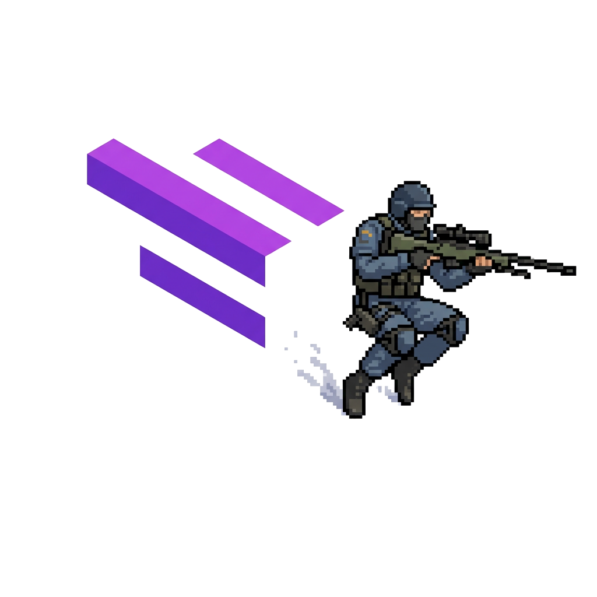

<div align="center">
 <h1> <br/>Minehop Addon</h1>

  
 <br>
  
  
</div>
<br/>

A [Meteor Client](https://github.com/MeteorDevelopment/meteor-client) addon that adds Source Engine-style bunnyhopping movement mechanics to Minecraft. Based on the original [Minehop mod](https://github.com/Plaaasma/minehop-fabric-public).

## Supported versions: 
- **Minecraft 1.21.11** (latest)
- **Minecraft 1.21.10** (up to v1.2.2)

## Features

- **Source Engine Movement Physics**: Implements CS:S/CS:GO style bunnyhopping with air strafing
- **Fully Configurable**: Adjust friction, acceleration, gravity, and other movement parameters in real-time
- **Meteor Integration**: Seamlessly integrates with Meteor Client's module system
- **Easy Toggle**: Enable/disable bunnyhopping with a simple keybind or GUI toggle

## Installation

### Prerequisites
- Minecraft 1.21.11
- [Fabric Loader](https://fabricmc.net/use/) 0.18.4+
- [Fabric API](https://modrinth.com/mod/fabric-api) 0.141.3+
- [Meteor Client](https://meteorclient.com/) 1.21.11-SNAPSHOT (build 65)

### Steps
1. Download the latest release from the [Releases](https://github.com/njlent/minehop-Meteor-client-addon/releases) page
2. Place `minehop-meteor-1.2.2.jar` in your `.minecraft/mods` folder
3. Launch Minecraft with the Fabric profile
4. Open Meteor GUI (default: Right Shift)
5. Navigate to **Movement** category
6. Enable the **Bunnyhopping** module

## Usage

### Enabling Bunnyhopping
1. Open Meteor GUI (Right Shift)
2. Go to **Movement** category
3. Toggle **Bunnyhopping** ON

### Movement Controls
- **Jump**: Space (hold for continuous jumping)
- **Strafe**: A/D while in the air
- **Forward**: W (minimal input for best results)

### Tips for Effective Bunnyhopping
1. **Timing**: Jump right as you land to maintain speed
2. **Air Strafing**: Move your mouse smoothly left/right while holding A/D in the air
3. **Minimal Forward Input**: Use W sparingly - most speed comes from strafing
4. **Practice**: Bunnyhopping takes practice to master!

## Configuration

All settings can be adjusted in the Meteor GUI under Movement > Bunnyhopping:

### General Settings
- **Crouch Height Adjustment**: Enable/disable enhanced crouch height adjustment (default: ON)
  - When enabled: Player height changes from 1.8 blocks (standing) to **1.35 blocks** (crouching)
  - When disabled: Vanilla behavior - 1.8 blocks (standing) to **1.5 blocks** (crouching)
  - Enhanced mode provides lower crouch for better movement physics
- **Entity Collisions**: Enable/disable player-to-player collisions while bunnyhopping is active (default: ON)
- **Speed Cap**: Maximum speed multiplier (default: 0.6)

### Movement Settings
- **SV Friction**: Ground friction coefficient (default: 0.35)
  - Lower = more slippery, higher = more grip
- **SV Accelerate**: Ground acceleration (default: 0.1)
  - How quickly you accelerate on the ground
- **SV Air Accelerate**: Air acceleration for strafe control (default: 1.0E99)
  - Essentially infinite for Source-style air control
- **SV Max Air Speed**: Maximum air speed (default: 0.02325)
  - Limits how much speed you can gain from air strafing
- **SV Gravity**: Gravity multiplier (default: 0.066)
  - Lower = floatier, higher = faster falling

### Advanced Settings
- **Speed Multiplier**: Overall speed multiplier (default: 2.2)
  - Scales all movement speeds
- **Speed Coefficient**: Speed calculation coefficient (default: 1.0)
  - Fine-tune speed calculations


<br>
<br>
<br>
<br>

## Building from Source

### Prerequisites
- JDK 21+
- Git

### Steps
```bash
# Clone the repository
git clone https://github.com/njlent/minehop-Meteor-client-addon.git
cd minehop-Meteor-client-addon

# Build the project
./gradlew build

# The compiled JAR will be in release/
```

## Technical Details

This addon modifies Minecraft's movement physics by injecting into the `LivingEntity.travel()` and `LivingEntity.jump()` methods using Fabric mixins. The implementation closely follows Source Engine's movement code, providing an authentic bunnyhopping experience.

### Key Components
- **Bunnyhopping Module**: Meteor module providing GUI controls
- **LivingEntityMixin**: Core movement physics implementation
- **MinehopConfig**: Lightweight internal configuration model used by movement logic
- **ConfigWrapper**: Manages config loading and synchronization

## Compatibility

- **Minecraft Version**: 1.21.11
- **Fabric Loader**: 0.18.4+
- **Meteor Client**: 1.21.11-SNAPSHOT (build 65)
- **Multiplayer**: Works on both singleplayer and multiplayer (server-side movement validation may vary)

## Known Issues

- **Boost Blocks**: Disabled in this version due to registry issues
- **HUD Features**: Removed in v1.2.0 due to incompatibility with Meteor Client's rendering system. Speed/SSJ/Efficiency displays are not available.

## Credits

- Original Minehop mod concept and implementation
- [Meteor Client](https://github.com/MeteorDevelopment/meteor-client) for the addon framework
- Source Engine movement physics inspiration

## License

This project is licensed under the MIT License - see the LICENSE file for details.

## Support

For issues, questions, or suggestions:
- Open an issue on [GitHub](https://github.com/njlent/minehop/issues)
- Join the discussion in the Issues tab

## Changelog

### Version 1.2.2 (Current)
- **BUILD: Minecraft target bump** - Updated to Minecraft 1.21.11 / Yarn 1.21.11+build.4
- **BUILD: Meteor target bump** - Updated dependency to Meteor Client 1.21.11-SNAPSHOT (latest build 65)
- **BUILD: Fabric updates** - Updated Fabric Loader to 0.18.4 and Fabric API to 0.141.3+1.21.11

### Version 1.2.1
- **FIXED: Jump Boost height** - Removed duplicate jump boost application in jump mixin
- **FIXED: Live speed cap** - Speed cap now uses active config value in movement logic
- **FIXED: Live friction updates** - Friction now reflects current settings without stale caching
- **IMPROVED: Entity collision control** - Added module setting for collisions and enabled by default
- **CLEANUP: Fall damage feature removed from module path** - Use Meteor's native NoFall
- **BUILD: Predictable release output** - `./gradlew build` now copies jars to `release/` with a stable `minehop-meteor-latest.jar`

### Version 1.2.0
- Moved Bunnyhopping module to Movement category
- Removed custom Minehop category
- Fixed default movement values to match original mod
- Fixed module state synchronization
- Improved config loading and initialization
- **Removed HUD features** (incompatible with Meteor Client's rendering system)
- Added `MovementUtil.isFlying()` helper method
- Cleaned up codebase and removed unused HUD-related code
- **NEW: Enhanced crouch physics** - Lower crouch height (1.35 blocks vs vanilla's 1.5 blocks) with toggleable setting
- **NEW: Dynamic friction system** - Different friction when crouching (0.85) vs normal movement
- **IMPROVED: Simplified ladder logic** - Cleaner, more reliable ladder climbing mechanics
- **FIXED: Status effects** - Proper support for Jump Boost, Slow Falling, and Levitation
- **FIXED: API compatibility** - Uses `isGliding()` instead of deprecated `isFallFlying()`
- Reduced JAR size to 53K

### Version 1.1.0
- Initial Meteor addon release
- Converted from standalone Fabric mod
- Basic bunnyhopping functionality
- Configurable movement parameters

---

**Enjoy bunnyhopping in Minecraft!** 🚀
